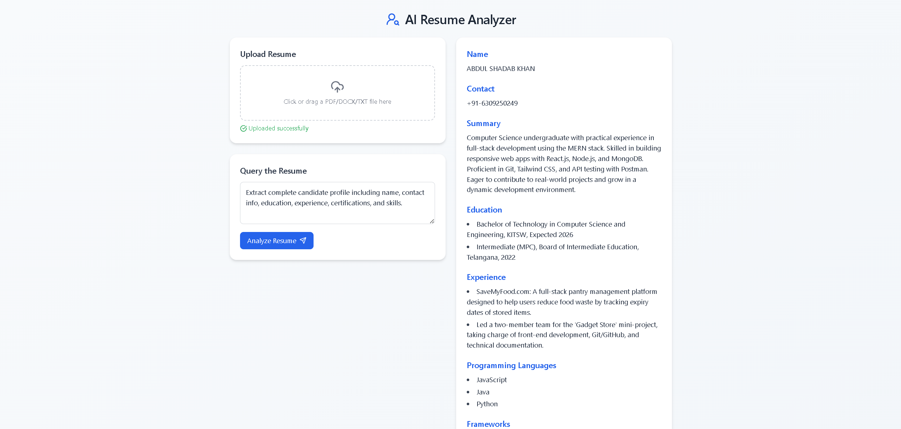

# AI Resume Analyzer

A full-stack web app that extracts structured candidate information and skills from resumes using LangChain, OpenAI, and Chroma vector store. HR can query resumes for eligibility, skills, experience, and certifications.

## Features
- Upload PDF, DOCX, or TXT resumes
- Extract candidate name, contact, education, experience, skills, certifications
- Answer custom HR queries using LLM + vector search
- Web interface built with React and Tailwind CSS
- Stateless backend with temporary vector store

## Tech Stack
- **Backend:** FastAPI, LangChain, OpenAI GPT-4, Chroma
- **Frontend:** React, Tailwind CSS

## Screenshot


## Installation

### Backend

```bash
pip install -r requirements.txt

Set environment variables in .env:
OPENAI_API_KEY=your_api_key

Run backend:
uvicorn main:app --reload

```
### Frontend

```bash
npm install

npm run dev

```

## Usage

1. Open the frontend in your browser.  
2. Upload a resume (PDF, DOCX, or TXT).  
3. Enter a query or use the default query.  
4. View the structured candidate information and extracted skills.

